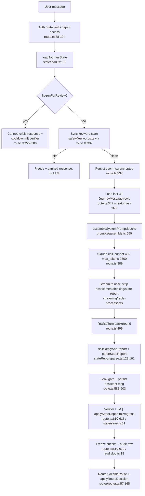

# Audit — Runtime Clinical Decision Pathway: Where Clinical Reasoning Is Replaced by Scripted Progression

**Date:** 2026-07-19 (second audit; extends `audit-2026-07-19-clinician-narrowing.md`)
**Scope:** read-only. No code, prompt, canon, or stage-file changes. No implementation.
**Machine-readable findings:** `audit-2026-07-19-runtime-clinical-decision-pathway.json`
**Product principle applied:** the AI is one senior clinician; memory, stages, channels,
practice generation, tracking, safety and continuity are subordinate systems that may
inform but must not independently determine the clinical route. Decision facilitation is
treated as IN SCOPE per the 2026-07-19 product rule (see §13.4).

---

## 1. Executive verdict

Clinical reasoning is not being *overridden* mid-turn — the model's reply streams to the
user unmodified except for tag-stripping and leak protection, and no code rewrites the
clinician's words. The replacement of clinical reasoning by scripted progression happens
**before and after** the reply, at four points:

1. **Before the turn**, the prompt corpus gives the clinician exactly one operationalised
   route (image–pattern–release, entered through five practice families and eight arc
   moves), a per-turn evidence checklist that fishes for emotion/body/gate tokens
   regardless of what the user asked, and a channel system that treats cognition as a
   corridor to the body. The clinician "decides freely" inside a menu with one dish.
2. **In the state layer**, nothing represents what the user asked for, what the session
   is trying to achieve, or whether it was achieved. The clinician cannot check its route
   against a contract that is never captured. The only formulation object
   (`continuityNote`) is optional free prose, truncated in the middle, and read by no code.
3. **In the reporting vocabulary**, work outside the arc is *inexpressible*: unknown
   moves, families, channels and next-modes are silently dropped by the parser, so
   non-arc work cannot be recorded, cannot count as progress, and cannot inform the
   next turn.
4. **After the turn**, progression and closure logic measure only arc artifacts
   (tokens, releases, identity statements, consensus checks) — never the request.
   Advancement requires arc evidence; regression is honoured on the AI's word alone;
   session closure has no code representation at all, so the prompt's release-shaped
   cycle rules are the only closure discipline — and they close against the method's
   state, not the user's ask.

The eight stages ARE presented rhetorically as a map (post-PR λ), and the router's stage
label is genuinely soft. But the map's territory contains only the arc's stations, and
every measurement instrument in the system counts only arc distance. The result observed
in the pilot — same path for very different users — is the deterministic output of this
architecture, not a model failure.

One direct canon–code contradiction was found: the Stage 1 gate still hard-requires the
anchor (`stage-gates.ts:113,120-121`) although canon §10 (revised 2026-07-02) and the
master prompt both dropped it. See §8.

---

## 2. End-to-end runtime map (one Journey turn)

Entry point: `POST /api/journey/turn` — `app/api/journey/turn/route.ts:87`.

### 2.1 Execution order



### 2.2 Step table

Columns: **Gen** = model-generated (M) / code-enforced (C); **Force** = advisory (A) /
mandatory (Man); **Override** = can it override clinician judgement; **Push** = does it
push toward emotion / body / imagery / pattern / release / identity language.

| # | Step | File / symbol | Input → Output | Gen | Force | Override | Push |
|---|---|---|---|---|---|---|---|
| 1 | Auth, rate-limit, char cap (4000), deletion/screening block, monthly cap, access | `route.ts:88-194` | request → allow/deny | C | Man | n/a | none |
| 2 | State load: RecodeProgress + capped landscape (parts 5, foreign 3, images 5, patterns 5) + ALL turn timestamps → continuity signals; last 10 turns → sensitivity signals | `load.ts:152` `deriveContinuitySignals:93` `deriveSensitivitySignals:359` | DB → `JourneyState` | C | Man (what the AI will see) | Shapes, not overrides | Landscape content is arc-typed (parts/foreign/images) |
| 3 | Frozen path: canned response; 20 s floor; keyword scan; cooldown-lift verifier | `route.ts:222-306`, `safety/verifier.ts` | msg → canned text / lift | C (+LLM classifier) | Man | **Yes — replaces clinician entirely (by design, safety)** | stabilisation |
| 4 | Sync keyword scan | `safety/keywords.ts`, `route.ts:309` | msg → freeze/continue | C | Man | Yes (safety) | none |
| 5 | Persist user message | `route.ts:337` | msg → JourneyMessage row | C | Man | no | none |
| 6 | Conversation history: last **30** messages (≈15 exchanges), leak-mask on assistant rows | `route.ts:61,347-387` | DB → messages[] | C | Man | Silently drops the opening request after ~15 exchanges | none (loss mechanism) |
| 7 | Working memory / archive: state block renders anchor, channel+family preference, parts, foreign files, patterns, images, continuityNote (head/tail truncated at 800 chars), open-cycle, rejections, time signals | `assemble.ts:150-414` | `JourneyState` → text | C | Man (content) / A (how AI uses it) | Injected directives (below) are Man-phrased | channel line pushes family; landscape is arc-typed |
| 8 | Channel detection — none code-side; the previous turn's `channel` emission, persisted last-write-wins | emit: model; persist: `save.ts:39,105`; render: `assemble.ts:171` + `CHANNEL_FAMILY_GUIDANCE:135-148` | prior emission → "Processing channel detected: X" + standing family preference | M (detect) / C (persist+render) | A in theory; rendered as standing guidance | — | **Yes: cognitive→"invite body location so the work does not stay in the head"** |
| 9 | Emotional-intensity detection — model's own 0-10 read, required every turn; persisted to `lastIntensity`; plaintext on audit row | schema `intensity`; `save.ts:41,107`; gates read it | model read → gate guard (≤5 to advance) | M (value) / C (consumption) | Man (required field) | Gates consume it as fact | none directly |
| 10 | Current-stage selection: `RecodeProgress.currentStage`, changed only by router; rendered as "bookkeeping label" | `router.ts:165-201`, `assemble.ts:167` | prior decision → label | C | A (per PR λ framing) | Stage-open injection is Man ("run it now", `assemble.ts:218-223`) | arc ritual on advance |
| 11 | Stage evidence + gate tokens: model emits `readinessTouched`, arc capture fields; Block-1 checklist mandates emission "EVERY turn" | master prompt 747-764; schema | conversation → tokens | M (emission) / C (consumption) | **Man-phrased checklist** | Starves/feeds gates | **Yes: emotion_named / body_located fishing** |
| 12 | Clinical-reading construction: silent per-turn read + 5 sensitivity questions; recorded only in `clinicalRead` prose | master `<clinical_reading>` 45-65; output_format 786-803 | user msg + state → hypothesis + move choice | M | Man (that it happens) / A (content) | — | Hypothesis pre-framed "what old programme might be running"; move menu = 8 arc moves |
| 13 | Route/move selection: "which move serves now — from the 8 moves"; Block 1 additionally restricted to assessment + anchor/regulation/light-compassion | master 56, 67-180, 182-232 | reading → move | M | A within a closed menu | — | **Menu itself is the arc** |
| 14 | Practice-family selection: 10-step hierarchy → 5 families; channel-aware selection | master 234-345; PGA §4-5; Shared Core §5 | signals → family | M within C-defined enum | A within closed enum | — | **Items 5-6: old voice→foreign material; signature image→landscape** |
| 15 | Practice generation: template (3-7 steps), personalisation, alternative rule, emission mandate + status lifecycle | PGA §6-§11; master 303-345 | family → practice text + `practiceRun` | M | Emission mandate Man-phrased | — | Families are regulation/somatic/landscape/narrative/compassion only |
| 16 | Response generation: warm reply + hidden report; streamed unmodified except tag-strip | `route.ts:389-487`, `reply-processor.ts` | prompt+history → text | M | — | **Nothing rewrites clinician content** | — |
| 17 | Parse + validate: defensive default {intensity 5, watch, stay}; enum whitelists **silently drop** unknown channel/family/move/mode values; no retry | `parse.ts:90-118,161-384` | raw → `StateReport` | C | Man | Drops what the vocabulary can't say | Vocabulary is arc-only |
| 18 | State mutation: channel overwrite; anchor set-once; `releasedAt` stamped on any `foreignFileReleased` emission; parts/patterns/images upserts; continuityNote overwrite; (`recommendedDepth` declared but never written — depth is router-only) | `save.ts:31-124,126-367` | report → DB | C | Man | Records model claims as facts (e.g. release) | arc-typed archive |
| 19 | Safety escalation: report red_flag → freeze; verifier clear_crisis → freeze; verifier ambiguous upgrades none→watch (worse-of-two recorded) | `route.ts:619-664` | report+verifier → freeze/audit | C (+LLM) | Man | Yes (safety; can override model's safety read upward) | stabilisation |
| 20 | Progress mutation (router): regress honoured on AI's word alone; advance needs classic gate (arc evidence + `recommendedAction: advance`) OR move-based lane (3 qualifying turns of stage-scoped arc moves, no advisory needed); +1 only; depth reset 'surface' | `router.ts:57-127,165-222`; `stage-gates.ts`; `move-based-advance.ts` | audit window → stage change | C | Man | **Yes: asymmetric — down free, up gated on arc artifacts** | progress = arc distance |
| 21 | Session-completion detection: **does not exist in code.** Sessions are 4-hour-gap derivations after the fact; open cycles and modality refusals are wiped at the next session boundary | `load.ts:32,380` | — | C | Man (the wipe) | Wipes unresolved-work signal silently | — |
| 22 | Closure generation: entirely model behaviour under prompt rules (closing practice from regulation/somatic/grounding; conditional 1-10 check only if destabilised; cycle-close = body softened + charge down + image positive + relief confirmed) | Shared Core §10:273; master 281-301, 803-826 | — → closing reply | M | Man-phrased rules | — | **Release-shaped completion criteria; no request check** |

### 2.3 Where the clinician can and cannot be overridden

- **Cannot be overridden:** the words of the reply (16). The clinician's judgement *as
  expressed to the user* is sovereign within a turn.
- **Overridden by design (safety):** freeze paths (3, 4, 19). Correct and out of scope.
- **Overridden structurally:** what the clinician can *know* (2, 6, 7 — capped, truncated,
  wiped), what it can *say about its work* (17 — vocabulary whitelist), what counts as
  *progress* (20 — arc artifacts only), and what survives to the next turn/session (18,
  21). These are the mechanisms by which scripted progression displaces clinical
  reasoning: not by contradicting the clinician, but by making only one route
  perceivable, expressible, and creditable.

---

## 3. Route-forcing mechanisms (complete inventory, classified)

Class A = hard enforcement in code · B = strong prompt pressure · C = soft guidance ·
D = harmless metadata. Ranked within class by likely user-facing effect. IDs match the
JSON findings file.

### Class A — hard enforcement in code

| ID | Mechanism | Location | Effect on behaviour |
|---|---|---|---|
| A1 | **Stage gates accept only arc artifacts as evidence** — tokens, `somaticRelease`, `cleanIdentityStatement`+`bodyConfirmation`, `internalConsensus`, `compassionBridgeQuality`, CAL layers, `adultSelfThisWeek` /close\|steady/ keyword match | `stage-gates.ts` (all 8 gates) | The only way any user progresses is to produce arc artifacts; the clinician is incentivised to elicit them |
| A2 | **Stage 1 gate contradicts canon**: still requires `anchorText` set AND `anchor_identified` token, both dropped from canon §10 on 2026-07-02 | `stage-gates.ts:113,120-121` vs `01-stage-stabilisation.md:146-158`; master 730 ("being retired") | A user who never offers qualifying anchor material cannot pass the classic Stage 1 gate; sustains anchor-hunting pressure canon tried to remove |
| A3 | **Asymmetric router**: `regress_to_grounding/parts` honoured instantly on the AI's advisory; advancement needs gate or move-lane proof. Plus parser's defensive default (`stay`/`watch`) on any malformed report | `router.ts:71-82`; `parse.ts:90-94` | Structural downward/hold bias: users accumulate time in Blocks 1-2, exactly where the permitted repertoire is narrowest (see B4) |
| A4 | **Move-based advance lane counts only `stage_N.*` arc moves**; `universal.*` never counts; advisory not needed | `move-based-advance.ts:47-51,75-88` | "Progress" is machine-defined as arc work; a session of superb cognitive/values work registers zero progress |
| A5 | **Parser enum whitelists silently drop the inexpressible**: channel (6 values), family (5), moves (38), `nextBestMode` (9 — no stay-cognitive), therapeuticMode (8). No retry, no logging of dropped values | `parse.ts:97-117,495-519`; `schema.ts:35-145` | Non-arc work cannot be recorded → cannot be seen by router, admin review, or the next turn's state block |
| A6 | **`processingChannel` last-write-wins** single value, presented back as a stable finding with a standing family preference | `save.ts:39,105`; `assemble.ts:171-176` | One turn's read becomes "the user's channel" with an attached practice-family directive |
| A7 | **Modality refusals and open cycles wiped at session boundary** (≥ 4 h) | `load.ts:331-334,380` | "No more body work" must be re-established every session; unresolved work loses its flag silently |
| A8 | **`releasedAt` stamped the moment the model emits `foreignFileReleased`** — even release-without-prior-identification inserts as released | `save.ts:225-281` | A release is recorded as fact on the model's claim; feeds the Stage 5 gate and the "released" archive shown every turn |
| A9 | **Working-memory horizon**: 30 messages; `continuityNote` middle truncated beyond 800 chars (head 400 + tail 300) | `route.ts:61`; `assemble.ts:388-399` | The user's original request falls out of raw history after ~15 exchanges and survives only if the model chose to write it into the note's surviving head |
| A10 | **Stage-advance opener injection**: "Refer to the active stage spec above for the canonical opener and run it now" | `assemble.ts:218-223` | First turn after advancement is scripted regardless of what the user brings |
| A11 | **No session-completion detection / no session state object** | absent (see §9) | Closure cannot be checked against anything code-side; the prompt's release-shaped rules are the only discipline |
| A12 | Safety freezes (keyword, verifier, report), worse-of-two audit recording | `route.ts:309,619-664` | Justified overrides; narrowing-neutral (kept for completeness) |

### Class B — strong prompt pressure

| ID | Mechanism | Location | Effect |
|---|---|---|---|
| B1 | **Block-1 per-turn checklist "NON-NEGOTIABLE"**: `emotion_named`/`body_located`/`orientation_present` "SHOULD be firing on nearly every turn"; 12 items every turn | master 747-764 | The observed interrogation style — fishing for a feeling word and a body location from every user, every turn |
| B2 | **Cognition treated as avoidance / bridge to body**: cognitive channel → "invite body location so the work does not stay in the head"; Stage 1 §7 "Gently shift focus from thought to body"; Example 3 converts self-analysis into parts work ("opens parts territory through their analytical door") | `assemble.ts:143`; master 264, 466-474; `01:90` | Cognitive users systematically redirected somatically; analysis reframed as a door to parts |
| B3 | **Practice hierarchy items 5-6**: any parental/critical sentence → foreign-material identification; any offered visual scene → landscape practice | master 249-258 | The pattern-search and image-capture reflexes seen in the pilot, verbatim |
| B4 | **Block-1 practice whitelist**: only anchor-observation, light regulation/grounding, light self-compassion; "Do NOT offer" list covers everything deeper; combined with A3's hold bias, most pilot users only ever met this reduced menu | master 201-213 | Early-journey users experience exactly the narrow set the testers reported: breathing, grounding, feet, warmth, affirmation |
| B5 | **The 8-move toolkit is the only move menu**; "Which move serves now. From the 8 moves" | master 56, 67-180 | Freedom of order, not of method |
| B6 | **Cycle grammar and closure are release-shaped**: cycles defined as parts/foreign/somatic arcs; close requires body softened + charge reduced + "image (if any) shifted positively or neutralised" + relief confirmed; state block injects "A THERAPEUTIC CYCLE IS OPEN… Do NOT close" | master 803, 819-826; `assemble.ts:231-239` | Successful-release becomes the operational definition of done |
| B7 | **Body/emotion as preferred source of truth**: "invite body location so it doesn't stay in the head" (twice); Stage 5 gate canon "without body confirmation the statement is head-only and canon explicitly does not count it"; hierarchy places body activation (item 3) above all non-safety work | master 264; `stage-gates.ts:320-326` comments; master 249-258 | Head-work is systematically discounted as incomplete |
| B8 | **Practice-emission mandate + status lifecycle** ("If anatomy ran, log it"; orphaned `started` rows are "data quality bugs") | master 305-321 | Pressure to shape conversational moves as loggable practice anatomies from the 5 families |
| B9 | **Hypothesis pre-framing**: "What old programme might be running?" in the every-turn reading | master 54 | Pattern-detection as default lens on every turn |
| B10 | **Share-back milestone emission mandate**: on confirmation "you MUST emit ALL THREE… Without all three, the Block 1 → Block 2 gate will not fire" | master 223-231 | Converts a clinical moment into a token-emission task (note: gate no longer reads `formulation_confirmed` — prompt drift, see §8) |
| B11 | **Closing practice constrained to regulation/somatic/grounding** | Shared Core §10:273 | Even a purely cognitive session must close somatically |
| B12 | **Channel line + standing preference rendered adjacent every turn** ("Processing channel detected: cognitive — Prefer narrative-family… invite body location…") | `assemble.ts:171-176` | Per-turn nudging toward a family before the user has spoken |

### Class C — soft guidance

C1 pattern-staleness reconfirm directive (`assemble.ts:341-345`); C2 PGA §5.2 ordering
(body > image > belief > shame); C3 stage-doc §7 channel adaptations; C4 settling-signal
gentleness (`signal.ts:59-70`); C5 counter-narrowing instructions that exist but are
outweighed — Trap 5 body-obsession, Trap 6 imposed imagery, Trap 11 formulation-riding,
M1 "historical context — not fact", "You lead… final call" (`assemble.ts:444`). C5 shows
the *intent* of a free clinician is present; the operational layers above defeat it.

### Class D — harmless metadata

Practice-run child rows, patterns table, AI-usage telemetry, state-report diagnostics
(PR κ), time buckets, leak detector, `recommendedDepth` (declared, never written — dead),
`moveJustPerformed` *as data collection* (though A4 made it load-bearing for routing).

---

## 4. Clinical-formulation audit

**Does a living clinical formulation exist? No.** What exists is one free-prose field and
scattered labels.

The only candidate is **`continuityNote`** (schema.ts:383; rendered `assemble.ts:371-399`;
shape specified in master `<memory>` 405-433: presenting issues, working hypotheses 3-5,
resources, worked so far, queued, stuck points, notes for next session).

Checked against the minimum representation required:

| Required element | Present? | Where / why not |
|---|---|---|
| Presenting request | Partial | "Presenting issues" section of the note *shape* — optional prose, no field, no guarantee |
| Expected help | **No** | Nowhere in any schema, prompt, or note shape |
| Immediate task of the conversation | **No** | No per-session object exists at all |
| Desired depth | **No** | Depth is a permission system (surface/middle/deep), never a user preference |
| Current processing style | Label only | `processingChannel` — one enum value, last-write-wins |
| Available modes | **No** | Implicit: whatever the 5 families allow |
| Unavailable modes | Session-scoped only | `sessionRejectedModalities`, wiped at 4 h boundary (A7) |
| Current working hypothesis | Partial | `clinicalRead` (per-turn) + note prose |
| Alternative hypotheses | Nominal | Note shape says "three to five… tentative"; nothing enforces plurality |
| Relevant context | Partial | Landscape captures — but arc-typed only (parts/foreign/images/patterns) |
| User preference or resistance | Session-scoped only | `modalityRejected`; no durable preference store |
| Interventions already attempted | **Stored but never shown** | `JourneyPracticeRun` rows exist in DB; **no code renders practice history into the prompt** — the clinician cannot see what it already tried beyond 30 messages unless it wrote it into the note |
| Response to intervention | **No** | `practiceRun.status` records completion, not effect |
| Unresolved activation | Session-scoped only | `cycleStatus` open/closing — wiped at boundary |
| Current session objective | **No** | — |
| Completion criterion | **No** (user-level) | Only stage-gate criteria exist — method-level, not request-level |
| Reason to continue / change route / close | **No** | — |

**Why the substitutes are insufficient:**

1. **Nothing is required.** Every formulation-adjacent field is optional; a turn that
   emits only `{intensity, safetyFlag, recommendedAction}` is fully valid (and the PR κ
   diagnostics in `route.ts:515-562` exist precisely because mid-session turns were
   doing exactly that).
2. **No code consumes it.** Gates, router, practice hierarchy and closure rules never
   read `continuityNote`. The formulation cannot influence progression even when it is
   excellent.
3. **Truncation eats the middle** (`assemble.ts:388-399`) — the accumulating body of a
   long formulation is dropped; only head (recent summary) and tail ("Next session:")
   survive into the prompt.
4. **Additive-only growth** ("Never wipe history; refine it", master 426) with a
   4,000-token-scale free-text field and no structure means signal decays into sediment
   — the exact problem PR M1 mitigated by demoting the note to "context, not truth".
5. **Isolated labels stand in for understanding**: stage, channel, intensity, named
   emotion, body location, pattern categories — all present; none of them is, or
   composes into, "who is this person and what do they want from me today."

---

## 5. Task-contract audit

**Where the presenting request is determined or preserved: nowhere, structurally.**

- **Stored:** only as the raw first user messages (encrypted `JourneyMessage` rows) and
  — if the model chose — inside `continuityNote` prose. No `sessionIntent`, no
  `presentingRequest`, no per-session record.
- **Survives prompt compression:** raw history survives 30 messages (`route.ts:61`), then
  is gone. The note's head usually survives (`assemble.ts:391-394`) *if* the request was
  ever written there — nothing instructs the model to.
- **Available during practice generation:** no. The hierarchy (master 249-258) reads
  safety, body signals, images, old voices, affect, shame — never the request.
- **Checked before stage progression:** no. Gates read arc tokens only (§3 A1).
- **Checked before closure:** no. Closure rules read body/image/charge/relief (§9).
- **Overwritable by later emotional material:** yes — body activation (hierarchy item 3)
  and channel overwrite (A6) preempt; an emotional Turn 6 redefines the whole session's
  routing with no instruction to return to the Turn 1 ask. The one guard that exists,
  `cycleCanClose` blocked while "the user has said the work is unfinished" (master 824),
  depends on the *user* re-asserting the request.
- **Explicit instruction to return to it:** none. The nearest text is Trap 11's "follow
  what is alive today" — which, without a contract object, actively legitimises request
  drift.

**The eight test requests, walked through the runtime as specified:**

| Request | Which mechanism captures it | What the runtime does with it |
|---|---|---|
| "Help me understand why I keep doing this." | Hierarchy item 5 (old voice) or B9 pattern lens; Example 3 template | Well-matched entry — but understanding is then routed toward parts/foreign framing rather than staying analytic |
| "I need to decide whether to leave my job." | Shared Core §4 prohibition + Trap 2 + Stage 6/7 no-decision rules | No handler. Redirected to feelings-under-the-decision; decision facilitation inexpressible (see §13.4 — now in scope, canon must change) |
| "I feel nothing and do not know what is wrong." | Hierarchy item 8 (foggy/numb) → regulation/grounding | Reasonable entry; then arc. "Numb" has no channel value (§7); long-term route defaults to body-finding |
| "I want practical clarity, not emotional exploration." | Nothing. B1 checklist still fishes `emotion_named` | Direct collision: the per-turn evidence mandate contradicts the user's explicit contract; no mechanism records or honours the "not emotional" clause beyond session-scoped `modalityRejected` (which has no 'emotional' value — enum is body/imagery/breathing/grounding only, `schema.ts:114-120`) |
| "What is the meaning of my life now that my children have left?" | Nothing (existential absent from corpus) | Routed to pain-identification (emotion of loss), likely mother/role foreign-material framing; the meaning question itself has no destination |
| "I only want help calming down today." | Hierarchy item 2 → regulation | **Served correctly** — the one contract the system natively honours |
| "I want to understand whether this belief is mine." | Move 5 / Stage 5 Origin Voice Mapping | **Served correctly** — this request IS the arc |
| "Please answer the question I asked before we go deeper." | Nothing | No mechanism represents an unanswered question; no closure or continuation rule checks one; honouring it depends wholly on the model noticing against prompt pressure |

Conclusion: 2 of 8 request types are natively served; the rest are converted into the
arc's terms or collide with per-turn evidence pressure. **No task-contract system
exists.** (Documented as absence; nothing implemented, per instructions.)

---

## 6. Intervention-repertoire matrix

Counting rule applied: a family counts as operational only if the runtime corpus gives
indication, contraindication, aim, process, examples, progress signals, failure signals,
and exit/containment. Classification: 1 fully operational · 2 partially · 3 name only ·
4 absent · 5 explicitly prohibited.

| Family | Class | Evidence |
|---|---|---|
| Clinical questioning | 2 | Soft Why is a complete anatomy (02 §8.2: indication, contraindication, 3 steps, forbidden, watch-for, completion). General structured questioning beyond it: voice-level guidance only ("The AI asks more than it tells") |
| Structured cognitive inquiry | 3 | "Sentence deconstruction" one line (05 §7 cognitive entry); no anatomy, no progress/failure signals |
| Cognitive reframing | 3 | PGA §3 list item "Gentle cognitive reframing"; Stage 6 §3 "Cognitive Reframing of Identity Beliefs" is scoped to identity residues and defined as "not through analysis, but through felt re-statement" — no general anatomy |
| Narrative exploration | 2→discouraged | "Narrative rewriting" family = transformation of an image/sentence/role (PGA §4.4). Story-work is actively redirected: "here-and-now over story" (01 §3), "Limit narrative" (01 §7), "don't invite the user to talk *about* an emotion in narrative" (02 §6) |
| Values clarification | 3 | ACT one line (00 §3:77); Stage 7 Values Mapping has indication but thin process, locked to Stage 7 and to "direction, not goals" |
| Identity exploration | 1 (arc-form only) | Stages 5-7 anatomies complete — but the only identity work possible is release→statement→symbol |
| Decision facilitation | 5 | Shared Core §4:94; Trap 2; Stage 6 §4/§6/§8.3; Stage 7 throughout; Stage 8 §4/§6. Full location list in §13.4 |
| Life mapping / timeline | 4 | Zero occurrences in runtime corpus and CLINICAL_MANUAL.md |
| Existential exploration | 4 | Zero occurrences ("existential" absent from all ~10K lines) |
| Behavioural experiments | 2 (stage-locked) | Stage 6 one-small-action and Stage 8 CAL are complete anatomies; unavailable Stages 1-5; framed as identity-embodiment, not hypothesis-testing |
| Practical problem-solving | 5 | "No advice, no plans, no instructions for life decisions" (00 §4:94) |
| Writing practices | 3 | "Letter to self" listed (PGA §4.5); "reflective journalling" aftercare mention (04 §11, 08 §3); no anatomy |
| Emotional processing | 1 | Affect Labelling & Somatic Mapping full anatomy (02 §8.1); witnessing; containment offers |
| Somatic processing | 1 | Somatic family + micro-movement targeting (master 271-279) + discharge rules (master 811-815) |
| Imagery | 1 | Landscape family + PGA §8 eight-step protocol + per-stage visual adaptations |
| Symbolic work | 1 | Symbolic Return (05 §8.2), Symbolic Identity Map (07 §8.2) — complete anatomies |
| Grounding | 1 | Regulation family, orientation, 5-4-3-2-1, worked examples |
| Containment | 1 | Containment offers (02), Securing the Part (04 §8.3), Red Flag protocol (00 §7) |
| Integration | 1 | Internal Consensus Check, Identity Anchoring Ritual, Self-Loyalty (06 §8) |
| Affirmation creation | 2 | Compassionate phrase / anchor phrases appear inside practices (01 §11 Example B); no standalone anatomy |
| Rituals | 1 (arc rituals only) | Release, anchoring, discharge rituals fully specified |

**Score: 8 fully operational — all on the somatic/imagery/release/identity arc. 5
partial. 4 name-only. 3 absent. 2 prohibited (1 of which is now declared in scope).**

**User types that cannot currently be served** (no operational repertoire): meaning/
existential seekers; decision-facilitation seekers; practical-clarity seekers;
analytic users who want to stay cognitive; life-review/timeline users; users whose
change vehicle is writing; behavioural experimenters before Stage 6.

---

## 7. Processing-channel audit

**Pipeline:** inferred by the model per substantive turn (`channel`, master 586) →
parsed against a 6-value whitelist (`parse.ts:97-99,183-184`) → persisted last-write-wins
(`save.ts:39,105`) → retrieved (`load.ts:287`) → rendered with an attached standing
family preference (`assemble.ts:171-176`) → used in intervention selection
(`CHANNEL_FAMILY_GUIDANCE` + master 260-269 channel-aware family selection) → next-mode
recommendation via `nextBestMode` (`schema.ts:126-137`).

**How each requested channel is treated:**

| Channel | In enum? | Treatment |
|---|---|---|
| cognitive | yes | Temporary entry point / bridge toward body. "Invite body location so the work does not stay in the head" (assemble.ts:143, master 264); "shift focus from thought to body" (01 §7); parts-door reframe (Example 3). Head-only work explicitly discounted by Stage 5 gate canon. **Not treated as a valid primary mode** |
| narrative | **no** | Closest is `verbal` → narrative-rewriting family; story-form actively limited (§6) |
| emotional | yes | Valid primary mode (compassion / affect labelling) |
| somatic | yes (`kinesthetic`) | Valid primary mode; also the preferred destination of other channels (B7) |
| visual/imagery | yes | Valid primary mode; also a trigger (any image → landscape practice, B3) |
| behavioural | **no** | No channel, no family; behavioural work stage-locked |
| practical | **no** | Absent |
| values-based | **no** | Absent |
| existential | **no** | Absent |
| disconnected/numb | **no** | Not a channel; handled as hierarchy item 8 (foggy → grounding). No way to persist "this user is presently numb" as a working mode |
| mixed | yes | Valid; guidance says "weave two families… do not default to regulation" |
| unknown | **no** | Parser drops invalid values; the *previous* channel persists — there is no honest "not yet known" state after the first emission |

**Can the model validly remain cognitive / practical / narrative / existential for an
entire session?** Text permitting it exists (Trap 5; hierarchy item 10 "keep talking";
"If the user can hear the sentence cognitively but cannot feel it somatically, the work
is cognitive — that's enough", 05 §7). But four mechanisms penalise it every turn: the
B1 token checklist still demands emotion/body evidence; the channel guidance issues a
standing body-invitation; gate progress requires body-located artifacts (A1, B7); and
the reporting vocabulary cannot even *recommend* staying cognitive (`NEXT_BEST_MODES`
has `switch_to_somatic`/`switch_to_imagery`/`use_narrative`/`use_compassion` but no
cognitive option). Staying cognitive is possible as behaviour and invisible as work:
it produces no tokens, no qualifying moves, no progress. Practical/existential cannot
be expressed at all.

**Refusal memory:** `modalityRejected` enum covers body/imagery/breathing/grounding only
— a user cannot even be recorded as refusing *emotional exploration* (relevant to test
request 4 in §5). Refusals last one session (A7).

---

## 8. Stage and gate audit

- **Stage label:** genuinely soft since PR λ — all 8 specs loaded; "bookkeeping label…
  NOT capability gates" (`assemble.ts:164-168,434-450`). The active-stage tunnel of the
  first audit is fixed. What remains stage-forcing:
  - **Block-1 behavioural restriction** (master 201-213) is not soft: while the router
    label is 1 (where the hold-bias A3 keeps most users), the prompt forbids the deeper
    moves and whitelists three shallow practice types.
  - **Stage-advance opener injection** (A10) scripts the first turn of each stage.
  - **`<assessment_phase>` share-back mandate** (B10) — note the **prompt-code drift**:
    the master still says "Without all three, the Block 1 → Block 2 gate will not fire"
    (l. 229) and lists `formulation_confirmed` as a checklist item (l. 758), but the
    gate stopped reading that token in PR #177. The model is still being pressed to
    obtain a confirmation ritual the code no longer needs.
  - **Stage 1 gate anchor contradiction** (A2) — the reverse drift: canon dropped the
    anchor gate on 2026-07-02; `checkStage1Gate` still enforces `anchorText` +
    `anchor_identified`. Master 730 even tells the model the token is "being retired."
    Until the move-lane happens to fire (3 turns of stage-scoped ≥2 moves), a user with
    no qualifying anchor material is held in Stage 1 by code that canon disowned.
- **Gate evidence is exclusively arc-artifact-shaped** (A1) — full list per gate in
  `stage-gates.ts`. No gate consults the request, the formulation, or the user's own
  view of progress. Two gates hard-code release-completes semantics: Stage 5
  (`somaticRelease` + `cleanIdentityStatement` + `bodyConfirmation`) and Stage 8's
  `/close|steady/i` English keyword match on `adultSelfThisWeek`
  (`stage-gates.ts:643` — also a RU-locale hazard, flagged in its own comment).
- **Move-based lane** (A4): the safety valve added because users got stuck — but its
  qualification predicate re-encodes the same assumption (only `stage_N.*` arc moves
  count), so it un-sticks only users whose sessions already look like the arc.
- **Windows:** gates read the last 10-120 turns (`router.ts:29-38`); Stage 6/7/8
  session-scoped checks use the 4-hour boundary helpers (`history.ts:126-189`).

---

## 9. Closure and continuation audit

**Rules that can advance/complete/close, and what each checks:**

| Rule | Trigger | Checks request? | Checks unresolved questions? | Checks activation? | Checks whether intervention helped? | Checks user wants to continue? |
|---|---|---|---|---|---|---|
| Stage advance (classic gate) | arc artifacts + advisory | no | no | yes (intensity/safety) | no | no |
| Stage advance (move lane) | 3 qualifying arc-move turns | no | no | yes | no | no |
| Regression | AI advisory alone | no | no | implied | no | no |
| Discharge | Stage 8 gate + advisory | no | no | yes | partially (CAL layers) | yes (`dischargeReadiness`, pushback check) |
| Cycle close (prompt) | body softened + charge down + image positive/neutral + relief confirmed | no | only if user re-asserts ("said the work is unfinished") | yes | release-shaped proxy | partially (relief confirmation) |
| Stabilising-before-closing 1-10 | only if in-session destabilisation occurred | no | no | yes | no | partially (score) |
| Practice completion → "save / repeat / move on / rest" offer | any completed practice (Shared Core §5.7, PGA §12) | no | no | yes | user-report proxy | offer only |
| Session close ritual (Shared Core §10) | model judgement | no | no | via closing practice | no | "user closes when done" |
| Session-boundary wipe | 4 h gap (code) | n/a | **deletes the open-cycle flag** | n/a | n/a | n/a |

**Premature-closure pathways identified:**

1. **P1 — calm-session close with no check at all.** If intensity never reached 6, no
   stability question is required; no rule references the opening request; the AI may
   close on "you named it, that's the work today" with the actual ask untouched.
2. **P2 — release-completes.** A successful image release satisfies every closure
   condition in the corpus (B6) — the exact pilot complaint: sessions end after the
   symbolic arc lands, not when the user got what they came for.
3. **P3 — post-practice closure invitation.** Every completed practice triggers the
   save/repeat/move-on/rest offer — a structural nudge to wind down after the practice
   rather than return to the conversation that motivated it.
4. **P4 — session-boundary amnesia.** Open cycles and refusals are wiped ≥ 4 h (A7);
   the next session opens with re-anchoring guidance, not with the unresolved thread —
   recovery depends entirely on `continuityNote` quality.
5. **P5 — identity-statement-as-terminus.** `cleanIdentityStatement` +
   `bodyConfirmation` close Stage 5 work; nothing distinguishes "statement produced"
   from "request addressed."
6. **P6 — stage-advance opener displacement.** On the first turn after advancement, the
   injected "run the canonical opener now" (A10) supersedes whatever the user brings.

No rule anywhere asks the three questions closure clinically requires: *has the original
request been addressed; what remains; does the user confirm completion against their own
aim* (relief-confirmation in B6 is against the cycle's aim, not the user's).

---

## 10. Conversation evidence — blocked; safe export procedure provided

**Status: could not be completed from this environment, and per the restriction ("do not
infer transcript behaviour without transcript evidence") no session analysis is included.**

Facts: transcripts live encrypted (AES-256-GCM, `lib/encrypt.ts`) in `JourneyMessage`
(`contentEncrypted`) and per-turn state reports in `JourneyTurn`
(`stateReportEncrypted`); `JourneyTurn` stores only a SHA-256 *hash* of the user message
(`audit/log.ts:19,31`), so turns must be paired with messages by timestamp. This sandbox
has no `DATABASE_URL` and no `MESSAGE_ENCRYPTION_KEY` (verified: env empty of both; only
`.env.example` present), so decryption is impossible here — by design.

**What is needed:** for each sampled user, a chronological export of
`JourneyMessage(role, content, stageAtTime, createdAt)` interleaved with
`JourneyTurn(stateReport, createdAt)`, pseudonymised (tester code instead of userId, no
emails), covering the ten sample categories in the task (visual/emotional, somatic,
cognitive, practical-decision, existential, numb, ignored-question, premature-close,
emotion/body-interrogation, worked-well).

**Safe export procedure (authorised admin, e.g. Julia, on a machine with prod env vars):**

1. Create `mindreset-app/scripts/export-pilot-transcripts.mjs` (the `scripts/` directory
   is gitignored — the export tool and its output must never be committed). Script body:

```js
// scripts/export-pilot-transcripts.mjs
// Usage: node scripts/export-pilot-transcripts.mjs <userId> <testerCode>
// Requires DATABASE_URL + MESSAGE_ENCRYPTION_KEY in env (run with prod .env).
import { PrismaClient } from '@prisma/client';
import { createDecipheriv } from 'crypto';
import { writeFileSync } from 'fs';

const [userId, testerCode] = process.argv.slice(2);
if (!userId || !testerCode) { console.error('usage: <userId> <testerCode>'); process.exit(1); }
const key = Buffer.from(process.env.MESSAGE_ENCRYPTION_KEY, 'hex');
function decrypt(v) { // mirrors lib/encrypt.ts enc:v1:<iv>:<tag>:<ct>
  const [, , iv, tag, ct] = v.split(':');
  const d = createDecipheriv('aes-256-gcm', key, Buffer.from(iv, 'hex'));
  d.setAuthTag(Buffer.from(tag, 'hex'));
  return d.update(Buffer.from(ct, 'hex'), undefined, 'utf8') + d.final('utf8');
}
const prisma = new PrismaClient();
const msgs = await prisma.journeyMessage.findMany({ where: { userId }, orderBy: { createdAt: 'asc' } });
const turns = await prisma.journeyTurn.findMany({ where: { userId }, orderBy: { createdAt: 'asc' } });
const rows = [
  ...msgs.map(m => ({ t: m.createdAt.toISOString(), kind: m.role, stage: m.stageAtTime, text: decrypt(m.contentEncrypted) })),
  ...turns.map(t => ({ t: t.createdAt.toISOString(), kind: 'state-report', stage: t.stageAtTurn, report: JSON.parse(decrypt(t.stateReportEncrypted)) })),
].sort((a, b) => a.t.localeCompare(b.t));
writeFileSync(`journey-export-${testerCode}.jsonl`, rows.map(r => JSON.stringify(r)).join('\n'));
console.log(`wrote ${rows.length} rows for ${testerCode}`);
await prisma.$connect && await prisma.$disconnect();
```

2. Select the ten sample users from `/admin/pilot` + `/admin/journey-inspect` (the
   inspector already decrypts state reports and `continuityNote` — use it to shortlist).
3. Run the script per user with a neutral tester code (`T1`…`T10`); skim each file and
   redact any third-party names before sharing.
4. Deliver the `.jsonl` files to the audit session via a private channel (paste, or a
   temporary private location) — **not** via a commit.

With those files, the turn-by-turn causal grid (request → active instructions →
intervention chosen → available alternatives → user response → route-change assessment →
closure justification, each tied to a §3 mechanism ID) can be completed as specified.

---

## 11. Ranked root causes (with the causal model)

**A. Confirmed root causes** (direct code/canon evidence; behaviour-level confirmation
still pending §10 transcripts — noted per cause):

| # | Root cause | Code/canon evidence | Runtime-behaviour evidence | Affected users | Severity | Frequency | Necessary? / Sufficient? | Depends on | Safest correction layer |
|---|---|---|---|---|---|---|---|---|---|
| RC1 | **Single-route intervention repertoire** — every operational tool is the arc; alternatives are name-only, absent, or prohibited | §6 matrix; §3 B3/B5/B8; greps (zero "existential" in ~10K lines incl. CLINICAL_MANUAL) | Pilot reports (owner-supplied); transcripts pending | All except visual/emotional arc-fits | Critical | Every turn | Necessary AND sufficient for narrowing | — | **Authored clinical canon** (+ PGA, master); enums later |
| RC2 | **No task-contract or formulation structure, consulted by nothing** | §4, §5; absence of any request/session-objective field; gates/hierarchy/closure never read the note | "Original question ignored" tester reports; transcripts pending | All; worst for practical/existential | Critical | Every session | Necessary for narrowing to go *unnoticed*; not sufficient alone | interacts with RC1, RC5 | **Master prompt** (contract questions + note shape) first; state model later |
| RC3 | **Per-turn gate-token/emission pressure** — non-negotiable checklist fishes emotion/body every turn; emission mandates shape turns into loggable arc anatomies | §3 B1, B8, B10; master 747-764 | "AI repeatedly asked for emotion or body data" tester category; transcripts pending | Cognitive, practical, numb users | High | Every turn (Blocks 1-2, where A3 holds users) | Sufficient for the interrogation style | amplified by A3 hold-bias | **Master prompt** (checklist rewrite) |
| RC4 | **Channel system conflates perception with method and discounts cognition** — cognitive→body standing pull; last-write-wins; no stay-cognitive recommendation; refusals wiped per session | §7; A5-A7, B2, B12 | Testers describing body-question repetition; transcripts pending | Cognitive/analytic, decision, numb users | High | Every turn for affected users | Contributory; not necessary | RC1 (families are the only destinations) | **assemble.ts constant + master mirror** (prompt-level); enums later |
| RC5 | **Closure and progression defined against method-state, not the request** — release-shaped cycle close; arc-artifact gates; asymmetric router; no session closure object | §8, §9; A1-A4, A11, B6, B11 | "Session closed prematurely" tester category; transcripts pending | All | High | Every session end / gate evaluation | Sufficient for premature-closure class | RC2 (nothing to close against) | **Master prompt** (close-against-request); progression logic later |

**B. Secondary causes** (real, smaller, or corrective-drift): RC6 Stage-1 anchor
canon–code contradiction (A2) — high severity for new users, single-line correction
layer: progression logic (gates). RC7 prompt-code drift on `formulation_confirmed`
(B10 vs PR #177) — master prompt. RC8 request loss via 30-message window + note
truncation (A9) — prompt assembly/memory. RC9 vocabulary invisibility (A5) — enums/
constants + parser observability. RC10 onboarding pre-frames patterns/parts/feelings
(`Journey.opener` in `messages/en.json`) — authored copy. RC11 session-boundary amnesia
(A7) — state model.

**Explicitly rejected as root causes** (per instructions, and on evidence): the language
model (behaviour matches instructions with high fidelity — including their gaps; the
PR κ diagnostics show *under*-emission of optional fields, not disobedience); the
methodology itself (the canon is coherent for its intended route; the defect is that it
is the *only* route and that subordinate systems measure nothing else); "more stages/
tools/classifiers" (the clinician lacks a formulation and a contract, not another
subsystem — §11 correction layers deliberately avoid new classifiers).

---

## 12. Immediate stabilisation plan (Section B — smallest reversible changes; NOT implemented)

Ordered; each is independent and reversible. 1-6 are prompt/constant edits; 7 is a
one-gate code alignment to already-approved canon.

| # | File · section | Current behaviour | Proposed behaviour | Reason | Expected effect | Regression risk | Test required |
|---|---|---|---|---|---|---|---|
| S1 | `docs/journey/runtime/journey-master.md` · `<clinical_reading>` (l. 45-65) | Reads state/hypothesis only; move chosen from 8 arc moves | Add contract questions to the every-turn reading: *what is this person asking for in this conversation (understanding / clarity / a decision to think through / emotional processing / calming / practical reflection); what do they expect; does my current route still match; has the original request been addressed yet — if unsure, ask them.* Record the answer each turn at the start of `clinicalRead` | RC2 | Route checked against the ask every turn; request survives via clinicalRead/continuityNote without schema change | Low — additive instruction; slight token cost | `master-prompt-cleanup.test.ts` still passes; behavioural fixture: 8 requests from §5, assert reply references the ask |
| S2 | `journey-master.md` · `<practice_generation>` hierarchy (l. 249-258) + family definitions (l. 237-245) | No branch for analytic/meaning/clarity work; narrative family = Soft Why/voice mapping/clean statement | Insert branch before item 10: *user is analysing, questioning meaning, weighing something, or asking for clarity → structured reflective work (narrative family): clarifying questions, values naming, gentle reframing — staying cognitive is valid work, not avoidance.* Widen the narrative-family definition accordingly (emit as `family: "narrative"` — no enum change) | RC1 (partial), RC3 | Cognitive/values work becomes offerable and loggable today | Low — widens, removes nothing | Assemble snapshot; fixture: User C persona stays cognitive ≥ 1 full exchange without body redirect |
| S3 | `lib/journey/prompts/assemble.ts` · `CHANNEL_FAMILY_GUIDANCE.cognitive` (l. 143) + mirror `journey-master.md` l. 264 | "…and invite body location so the work does not stay in the head" | "…structured reflection and narrative work are complete work in themselves. Offer a body location at most once, only when the user shows live somatic activation, and drop it on refusal" | RC4 | Ends the standing somatic pull on cognitive users | Low — guidance string only | `state-block.test.ts` snapshot update; fixture as S2 |
| S4 | `journey-master.md` · Block-1 checklist (l. 747-764) | Tokens "SHOULD be firing on nearly every turn"; checklist "NON-NEGOTIABLE" | Reframe: emit tokens **when observed, never elicit for the gate's sake**; delete the "nearly every turn" expectation; keep the checklist as an emission reminder, not an evidence quota | RC3 | Stops emotion/body interrogation of non-emotional users | Medium — Stage-1/2 gates may close slower for genuinely emotional users; mitigated by S7 + move lane | Gate tests unchanged (code untouched); fixture: request 4 of §5 gets zero unprompted emotion/body questions in 5 turns |
| S5 | `journey-master.md` · closing rules (Stabilising-before-closing l. 281-301; add to `<output_format>` close guidance) + Shared Core §10 l. 273 mirror-note | Close = fitting practice + soft line + offer; checks body/image/charge only | Add: *before closing, check the close against what the user came with ("we started with X — where is that now for you?"), name what remains open, and take a now-number when a baseline was taken earlier. A completed release is one valid ending, not the definition of one. Closing practice fits the session's mode — a cognitive session may close cognitively* | RC5 (P1-P3, P5) | Closure answers the request, not the ritual | Low-medium — longer closes; Shared Core edit needs owner sign-off (canon) | Fixture: premature-close scenario ends with request-reference; existing close-protocol tests |
| S6 | `journey-master.md` · `<assessment_phase>` l. 223-231 + checklist item 10 (l. 758) | "Without all three, the Block 1 → Block 2 gate will not fire" (false since PR #177) | Correct to: the share-back remains clinically required; the gate no longer reads `formulation_confirmed`; keep emitting it as a signal token only | RC7 | Removes pressure to extract a confirmation ritual; prompt tells the truth about the code | Minimal | `master-prompt-cleanup.test.ts` |
| S7 | `lib/journey/router/stage-gates.ts` · `checkStage1Gate` (l. 99-129) | Requires `anchorText` set + `anchor_identified` token — contradicts canon §10 (2026-07-02) and master l. 730 | Delete both checks (keep emotion-or-body-state, orientation, guards) — pure alignment of code to approved canon | RC6 | Users without anchor material stop being held in Stage 1; removes the last structural reason to hunt anchors | Low — loosens one gate in the canon-approved direction; move-lane already bypasses it sometimes | Update `stage1-gate.test.ts` (drop anchor cases, add no-anchor-passes case); full `npm test` |

Not in this list on purpose: no new schema fields, no new enums, no classifier, no
memory rework — those are Section C. S1-S6 are reversible by git revert with zero data
migration; S7 touches only gate logic already governed by tests.

---

## 13. Full clinician architecture plan (Section C — requires design + new authored canon; NOT the stabilisation patch)

### 13.1 Runtime architecture
- Introduce a **session object** (code-side): opened on first turn after boundary,
  carrying `presentingRequest` (user's words), `sessionIntent` (enum-light), baseline
  intensity (asked, not inferred), and a closure record (final intensity, user
  confirmation, unresolved carry-over). Closure writes carry-over into the formulation.
- Keep the single-clinician principle: no new classifiers. The *model* fills these
  fields; code only stores, renders, and checks presence at close.

### 13.2 Clinical formulation
- Promote `continuityNote` to a **structured formulation** with the §4 element list
  (request, expected help, task, desired depth, processing style, available/unavailable
  modes, hypotheses + alternatives, attempted interventions + response, unresolved
  activation, session objective, completion criterion, continue/change/close reason).
  Rendered at the top of the state block, above the landscape; sized by sections, not
  head/tail truncation. Render recent `JourneyPracticeRun` history (already in DB,
  currently never shown) into "attempted interventions".

### 13.3 Intervention repertoire (new authored canon — Julia)
- Author operational playbooks (indication → exit logic, per the §6 counting rule) for:
  structured cognitive inquiry; values clarification; existential/meaning exploration;
  decision facilitation (per §13.4); life mapping/timeline; writing practices;
  behavioural experiments (unlocked from stage 6); practical reflection.
- Extend `PracticeFamily`, `CANONICAL_MOVES`, `NEXT_BEST_MODES`, `THERAPEUTIC_MODES`,
  `MODALITIES_REJECTED` (add `emotional_exploration`), and `JourneyChannel`
  (or better: split *perception channel* from *working mode* — two fields) in
  `schema.ts`/`types.ts` + parser, so the new work is expressible and creditable.
  This cannot be prompt-engineered; canon first, then enums, then prompt.

### 13.4 Decision facilitation — prohibition inventory and replacement wording
Product rule (2026-07-19): decision facilitation is IN SCOPE. The AI must not choose for
the user, prescribe an option, present its judgement as the correct life choice, or give
regulated professional advice. It may clarify the decision, distinguish facts from
assumptions, surface values/needs/constraints/learned fears, explore trade-offs, compare
options, design safe behavioural experiments, and help the user sense alignment.

Every current prohibition site (none modified yet):

| Location | Current wording (abridged) | Proposed replacement direction |
|---|---|---|
| `00-shared-core.md` §4 l. 94 | "No advice, no plans, no instructions for life decisions." | "No advice: the AI never tells the user what to choose, never presents its own judgement as the right life choice, and gives no regulated professional advice (medical, legal, financial). **Decision facilitation is permitted**: clarifying a decision the user faces — separating facts from assumptions; naming values, needs, constraints and learned fears; exploring trade-offs and uncertainty; comparing options; designing small, safe behavioural experiments — while the choice itself always remains the user's." |
| `journey-master.md` Trap 2 l. 352 | "Do NOT push toward 'leave him', 'move out', 'change your job'…" | Keep the push-prohibition verbatim; append: "Facilitating a decision the user has brought is not pushing. Clarify it with them; never weigh in on the answer." |
| `journey-master.md` Example 9 | Constrained-user reframe "the work is in here" | Add a companion example: user asks for decision clarity → AI structures the decision without advising |
| `06-stage-integration.md` l. 61, 103, 249 | "not asked to make a life decision… Do not invite… Do not allow the chosen action to be a major life decision" | Scope to *impulsive/urgency-driven* decisions during identity work; explicitly exempt structured facilitation of a decision the user brought |
| `07-stage-new-identity.md` l. 19, 58-65, 99, 105-116, 245 | "Mapping only. No decisions." + forbidden-moves list + per-session Safety Reorientation | Preserve the euphoria/urgency safeguards (they answer a different risk); rewrite "no decisions" to "no *committing* from the euphoric state; facilitation of a standing decision is done from the steady place, with the §13.4 boundaries" |
| `08-stage-embodiment.md` l. 67, 110-111 | "No major life decisions, still… Do not endorse a major life decision, even now" | Same split: never endorse an option; facilitation permitted |
| `stage-gates.ts` `checkStage7Gate` urgency check (l. 502-505) | `urgencyMarkers: present` blocks advance | Keep — urgency is orthogonal to facilitation; document the distinction in the stage doc |

### 13.5 Stage semantics
- Re-specify gates as **capacity evidence** (regulation capacity, self-observation,
  the user's own progress report against their request) rather than artifact evidence,
  so non-arc routes can also progress; keep safety guards unchanged. Extend the move
  lane (or replace it) to credit the new move vocabulary.

### 13.6 Practice generation
- Make the hierarchy request-aware: contract first (from the formulation), safety
  second, signals third. "Else → keep talking" stops being the only non-arc branch.

### 13.7 Memory
- Durable preference/refusal store (modality refusals, "stays cognitive", "asks for
  practical framing") surviving session boundaries; carry open threads across the 4-hour
  wipe via the session-close carry-over record (13.1).

### 13.8 Closure
- Session-close protocol: baseline vs now (user-reported), request check, unresolved
  naming, user confirmation *against their aim*, carry-over write. Cycle rules stay for
  activation safety but stop being the definition of done.

### 13.9 Observability
- `/admin/journey-inspect`: render the formulation, session contract, and per-turn
  "route rationale" (from `clinicalRead`); log dropped enum values in `parse.ts` (today
  silently discarded — A5) so vocabulary gaps become measurable.

### 13.10 Evaluation
- Persona fixtures (§5's eight requests + first audit's four user types) run against
  the assembled prompt on every master-prompt PR; assertions: contract acknowledged,
  mode held, no unprompted body/emotion pivot, closure references request.

---

## 14. Required regression and behavioural tests

**Regression (existing suites, must stay green):** all 151+ vitest tests; specifically
`stage1-gate.test.ts` (rewritten for S7), `assemble.test.ts`, `state-block.test.ts`,
`master-prompt-cleanup.test.ts`, `move-based-advance.test.ts`, parser suites.

**New behavioural fixtures (needed before/after any stabilisation merge):**
1. Eight task-contract requests (§5) → assert first reply engages the stated ask; no
   emotion/body question when the request excludes it (request 4).
2. User C persona (cognitive, meaning) → 5-turn run stays cognitive; ≤ 1 body
   invitation total; closure references the meaning question.
3. User D persona (decision) → post-13.4 only: decision structured, no option endorsed.
4. Premature-close scenario: user asks question, AI runs a practice, practice completes
   → assert close references the unanswered question (S5).
5. Stage-1 no-anchor user: 10 clean turns, emotion+orientation tokens, no anchor →
   gate passes after S7 (today: blocked).
6. State-report emission health: PR κ diagnostics (`failureModeGuess`) sampled before/
   after S1-S6 to confirm the added instructions don't worsen truncation (B-case) at
   `MAX_TOKENS` 2500.

---

## 15. Unknowns and missing evidence

1. **Transcripts** (§10) — the entire conversation-evidence layer. Export procedure
   provided; until run, every "affected users" and "frequency" claim above is
   architecture-derived, corroborated only by the owner's pilot summaries.
2. **State-report emission compliance in production** — PR κ `[journey/state-report-diag]`
   lines in Vercel logs would show how often optional fields (incl. `clinicalRead`,
   `modalityRejected`, `cycleStatus`) are actually emitted; the sensitivity layer is
   only as real as those emissions.
3. **Move-lane firing history** — `[journey/router] advance` log lines (lane field)
   would show whether users are progressing via arc-move accumulation without gates,
   and how often the Stage-1 anchor contradiction (A2) is being masked by it.
4. **RU-locale behaviour** — Stage 8's `/close|steady/i` English keyword gate
   (`stage-gates.ts:643`) and all fixtures above need RU variants.
5. **Whether widened prompts suffice** — S1-S6 assume the model will use a wider menu
   when given one; needs the §14 fixtures A/B before Section C investment.
6. **Verifier false-positive rate** on deep clinical work (freeze → stabilisation
   register on return) — a minor potential narrowing amplifier, unmeasured.

---

## Summary answers required by the task

- **Five highest-confidence root causes:** RC1 single-route repertoire; RC2 absent
  task-contract/formulation; RC3 per-turn token/emission pressure; RC4 channel system
  discounting cognition; RC5 method-state closure and arc-artifact progression.
- **Can the current architecture support a truly adaptive clinician without structural
  change?** Partially. The single-clinician frame, prompt assembly, state block, and
  advisory router are sound and can carry S1-S7 to a materially better place. It cannot
  become *genuinely* adaptive without: authored non-arc canon (RC1), a formulation/
  contract structure something actually consults (RC2), and an expressible vocabulary
  (A5) — i.e. Section C items 13.2-13.4.
- **Safe to implement immediately (post-approval):** S1-S6 (prompt/constant edits),
  S7 (canon-alignment gate fix). None implemented yet, per restrictions.
- **Requires new authored clinical canon (Julia):** existential/meaning work, values
  clarification, decision facilitation (13.4 wording), life mapping, writing practices,
  early-stage behavioural experiments, practical reflection; plus the Shared Core §4
  rewording and stage-doc decision-language edits.
- **Evidence still missing:** transcripts (procedure in §10), emission-compliance and
  router-lane production logs, RU-locale checks.
- **Recommended order:** (1) approve + run S7 and S6 (truth-alignment, zero clinical
  risk); (2) S1-S5 as one reviewed master-prompt PR; (3) run §14 fixtures + transcript
  export, complete §10; (4) decide Section C scope on that evidence — canon authoring
  (13.3/13.4) before any schema/enum work; (5) enums + formulation structure; (6) gate
  re-specification last, once the new vocabulary has production data.
