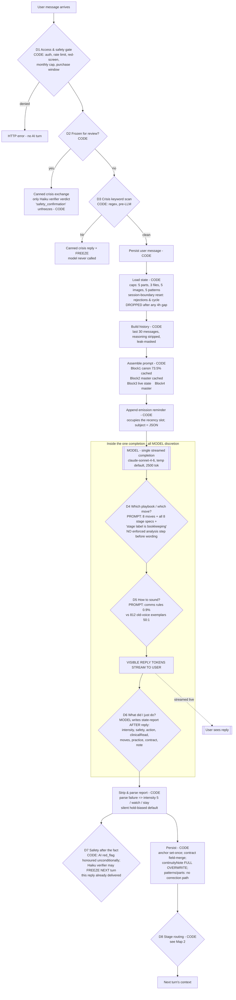
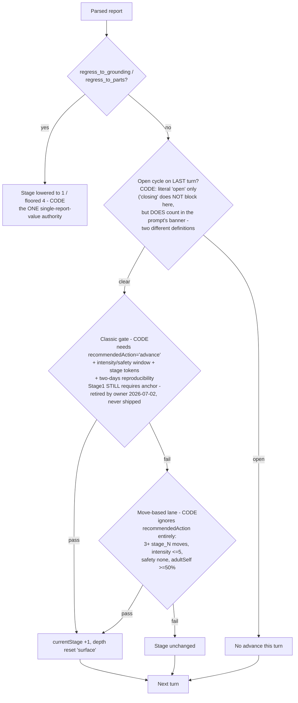
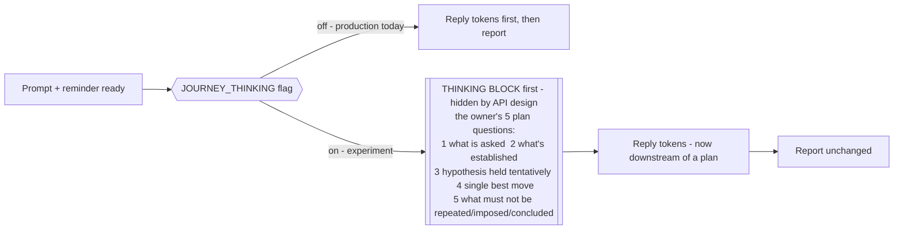

# AI Decision Flow Map — Journey Runtime (2026-07-21)

Every decision made in one Journey turn, WHO makes it (CODE = enforced in TypeScript,
MODEL = the LLM's discretion, PROMPT = instruction the model may ignore), and WHEN it
happens relative to the visible reply. Verified against the audited runtime
(`audit-2026-07-21-runtime-integrity/01`); read-only documentation — changes nothing.

## Map 1 — One turn, start to finish



**The structural fact the map shows:** every clinical decision that shapes the reply
(D4, D5) happens inside one unplanned generative pass — the analysis artefact (D6)
is produced after the reply tokens have already reached the user, and code only ever
acts downstream (D7, D8, next turn). Nothing upstream of the reply contains a plan.

## Map 2 — Stage routing decision (post-turn, CODE)



Fields the model emits that **no code reads**: `cycleCanClose`, `stabilityCheck.score`,
`currentDepth` (dead — always "surface"), `clinicalRead` (except 240-char open-cycle
echo within the same session). Session CLOSE has no code concept at all — close
discipline is prompt-only.

## Map 3 — Where the approved Thinking experiment inserts (flag-gated, not built into production)



This is the only architectural difference the experiment tests: D4/D5 gain an enforced
pre-reply step. Everything else (parsing, persistence, routing, safety) is untouched.

## Authority summary

| Decision | Owner today |
|---|---|
| Can the turn happen (access, crisis, freeze) | CODE |
| What the AI knows this turn (state caps, 30-msg history, truncations, session resets) | CODE |
| Which clinical move, which playbook, when to practice | MODEL (prompt advisory; no pre-reply check) |
| How the reply sounds | MODEL (comms rules outweighed 50:1 by legacy exemplars) |
| What gets remembered (report fields) | MODEL writes / CODE filters & merges |
| Crisis response | CODE (3 triggers; verifier post-delivery) |
| Stage progression | CODE (two un-reconciled lanes) |
| Session close | NOBODY (prompt-only discipline) |
| Depth | NOBODY (dead field) |
```
